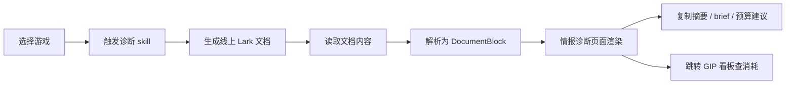

# PRD | 情报诊断模块

负责人：Rena | 版本：v0.2 | 日期：2026-06-04

## 1. 模块定位

情报诊断是「情报与运营台」的收口模块。运营输入或从上游模块带入一个游戏后，系统自动调用诊断 skill 生成一份线上分析文档，并把文档中的结论、数据、竞品对比和营销建议结构化渲染到 Web 页面里。

本模块解决的问题不是「展示一份静态报告」，而是把原本需要人工拉数、写分析、整理话术的诊断流程产品化：

- 运营不需要重新组织报告结构，只要选择游戏并触发诊断；
- skill 负责生成标准化线上文档，沉淀完整分析过程和引用来源；
- 前端页面负责把文档内容转成可扫读、可复制、可跳转的诊断视图；
- 推荐动作必须能回到数据、情报或内容信号，避免空泛建议。

一句话：**输入一个游戏，自动生成一份可追溯的线上诊断文档，并在情报诊断页面渲染成运营可直接使用的拜访弹药。**

## 2. 用户场景

### 2.1 拜访前深度作业

厂商运营准备见某个游戏厂商，希望快速知道：

- 这个游戏最近在 TikTok 上做得怎么样；
- 短视频和直播分别强在哪里、弱在哪里；
- 和竞品相比缺口是什么；
- 是否值得继续投达人激励预算；
- 预算应该投短视频还是直播，投哪些国家、达人和主播；
- 哪些话术可以直接发给项目方或用于会议沟通。

### 2.2 从上游模块进入

运营可以从情报抓取或内容雷达进入诊断：

- 从情报进入：诊断需要结合最近版本、活动、上线、联动等市场动作；
- 从内容雷达进入：诊断需要消费内容机会信号，例如内容缺口、新梗冒头、直播供给不足；
- 从首页搜索进入：诊断直接按游戏名生成或读取最近一份报告。

## 3. 核心产品链路



### 3.1 触发方式

本期支持三种入口：

1. 页面 URL 参数：`/diagnosis?gameId=yanyun`。
2. 上游模块按钮：「生成诊断报告」。
3. 页面内按钮：「重新生成 / 重新分析」。

### 3.2 skill 产物

每次根据游戏运行诊断 skill，产出两份内容：

1. 线上 Lark 文档：给人看、用于评论、复盘和沉淀；
2. 结构化 JSON：给诊断页面稳定渲染。

线上文档是完整分析母版，要求保留：

- 报告标题和更新时间；
- 统计周期和数据口径；
- 执行摘要；
- 短视频生态分析；
- 直播生态分析；
- 竞品对比；
- 国家结构和重点市场；
- 预算建议；
- 对项目方可直接复用的话术；
- 参考来源和数据链接。

结构化 JSON 是页面主输入，至少包含：

- 游戏 ID 与游戏名；
- 原 Lark 文档链接；
- 执行摘要；
- 短视频指标、排名、重点国家；
- 直播指标、排名、重点国家；
- 预算建议；
- 可复用话术；
- 图表数据。

页面不依赖抓取 Lark 文档里的内嵌图片或虚拟滚动正文，因为该方式在权限、懒加载和 DOM 暴露上不稳定。

### 3.3 页面渲染

诊断页面不直接硬编码某款游戏的报告，而是渲染文档解析后的块结构。当前前端数据结构为 `DocumentBlock`，需要覆盖：

- `sectionHeader`：章节标题；
- `paragraph`：分析正文；
- `bulletList`：结论列表和建议列表；
- `table`：指标表、竞品表、国家结构表；
- `image`：趋势图、国家结构图、案例截图；
- `callout`：关键结论、风险提示、预算判断。

页面的职责是把长文档变成运营可扫读的工作台，而不是简单 iframe 嵌入文档。

## 4. 报告内容结构

情报诊断页面固定渲染五段：

### 4.1 结论卡

首屏必须先给结论，避免运营先读长文。

字段：

- 游戏名；
- 诊断标签，例如短视频驱动型、直播驱动型、欠开发、有风险；
- 总体判断；
- 是否建议继续投达人激励预算；
- 优先动作 Top 3。

验收标准：

- 运营 10 秒内知道这款游戏该不该继续投；
- 结论必须引用下方具体数据或信号。

### 4.2 平台生态

展示游戏在 TikTok 平台的短视频和直播表现。

短视频核心指标：

- 总 VV；
- 日均 VV；
- 总投稿数；
- 日均投稿数；
- 条均 VV；
- 消费国家 Top；
- 供给国家 Top。

直播核心指标：

- 总看播时长；
- 日均看播时长；
- 总看播人数；
- 总开播主播；
- 日均开播主播；
- 单位开播产出；
- 消费国家 Top；
- 供给国家 Top。

验收标准：

- 每个指标都有时间窗；
- 关键指标能和竞品或中位数比较；
- 不展示没有口径说明的孤立数字。

### 4.3 近期动作

引用情报抓取模块中该游戏最近发生的事件。

内容包括：

- 事件类型；
- 时间；
- 来源；
- 对运营意味着什么；
- 诊断中的影响判断。

验收标准：

- 近期动作不是新闻复述，而要解释为什么影响预算或内容打法；
- 如果没有近期动作，需要展示「暂无强情报信号」。

### 4.4 竞品对比

将当前游戏和 1-4 款竞品放在同一口径下比较。

必要对比：

- 短视频消费、供给、单位供给产出；
- 直播消费、供给、单位开播产出；
- 国家结构差异；
- 内容形态缺口；
- 预算动作差异。

验收标准：

- 竞品对比必须产出缺口结论；
- 缺口结论要能被推荐动作消费。

### 4.5 推荐营销动作

这是诊断报告最重要的部分。每条动作都必须包含：

- 动作标题；
- 为什么现在做；
- 引用的数据、情报或雷达信号；
- 适用国家；
- 适用达人 / 主播层级；
- 预算档位：高 / 中 / 低；
- 预期效果；
- 可复制 brief。

动作示例：

- 短视频高消费低供给国家定向加码；
- 直播高看播低开播国家补主播；
- 跨垂类内容模板提效；
- 头部主播带动 + 中腰部铺量；
- 低承接国家暂停粗放扩量。

验收标准：

- 不允许出现「建议加强内容运营」这类空话；
- 强信号必须进入推荐动作；
- brief 可以一键复制。

## 5. 数据与文档契约

### 5.1 页面内部契约

当前页面使用以下结构渲染：

```ts
type DiagnosisDocument = {
  gameId: string;
  gameName: string;
  title: string;
  subtitle: string;
  badge: string;
  blocks: DocumentBlock[];
};
```

短期实现可以继续使用 markdown / mock 数据转 `DocumentBlock`；正式 demo 输入以「Lark 原文档链接 + 结构化 JSON」为准。长期实现可以让 Lark agent 直接输出与 `DiagnosisDocument` 同构的 JSON。

### 5.2 skill 输出契约

skill 需要至少输出两类结果：

1. 线上文档链接：供用户打开完整报告、评论和沉淀；
2. 结构化摘要与图表数据：供前端稳定渲染。

建议结构：

```ts
type DiagnosisSkillOutput = {
  gameId: string;
  gameName: string;
  documentUrl: string;
  generatedAt: string;
  period: {
    start: string;
    end: string;
  };
  summary: {
    label: string;
    conclusion: string;
    budgetDecision: string;
    priorityMarkets: string[];
  };
  kpis: {
    label: string;
    value: string;
    note: string;
  }[];
  charts: {
    title: string;
    unit: string;
    rows: {
      name: string;
      value: number;
    }[];
  }[];
  marketBars: {
    market: string;
    shortVideo: number;
    live: number;
  }[];
  blocks: DocumentBlock[];
  sources: {
    title: string;
    url: string;
  }[];
};
```

### 5.3 文档解析规则

文档到页面的解析遵循以下规则：

- 一级标题作为报告标题；
- 二级 / 三级标题转为 `sectionHeader`；
- 普通段落转为 `paragraph`；
- 列表转为 `bulletList`；
- Markdown 表格转为 `table`；
- 图片转为 `image`；
- 以「结论」「建议」「风险」「注意」开头的重点段落可提升为 `callout`。

## 6. 页面交互需求

### 6.1 首屏

首屏展示：

- 游戏上下文条：游戏名、厂商、品类、统计周期；
- 报告状态：已生成 / 生成中 / 失败 / 使用缓存；
- 结论卡；
- 文档链接；
- 操作按钮：重新生成、复制摘要、复制 brief、查 GIP。

### 6.2 正文区

正文区按报告结构分段渲染，支持：

- 表格横向滚动；
- 图片预览；
- 章节锚点；
- 重点结论 callout；
- 来源链接展示。

### 6.3 异常状态

需要覆盖：

- 无该游戏报告：展示生成入口；
- skill 生成失败：展示上一次缓存报告；
- 文档无法读取：展示 Lark 链接和失败原因；
- 文档为空或解析失败：展示原始文档链接，并提示解析异常。

## 7. 与其他模块的关系

### 7.1 情报抓取 -> 情报诊断

传入：

- 游戏；
- 近期事件；
- 事件重要度；
- 对运营意味着什么。

诊断消费方式：

- 放入「近期动作」；
- 影响预算建议；
- 作为推荐动作的依据。

### 7.2 内容雷达 -> 情报诊断

传入：

- 机会信号；
- 内容缺口；
- 优质内容案例；
- brief 草稿。

诊断消费方式：

- 强信号必须进入推荐营销动作；
- 内容缺口需要在竞品对比中被印证；
- brief 草稿可直接复用或改写。

### 7.3 情报诊断 -> GIP 看板

传出：

- 游戏；
- 推荐预算方向；
- 国家 / 达人 / 主播筛选建议。

GIP 看板消费方式：

- 展示该游戏历史预算和消耗；
- 展示同品类 benchmark；
- 支撑最终预算水位判断。

## 8. Demo 范围

本期黑客松 demo 不追求全量自动化，优先保证一款 hero 游戏端到端跑通。

必须完成：

- 一份真实或半真实的线上文档；
- 一份同游戏结构化 JSON；
- JSON 转成 `DiagnosisDocument`；
- 页面渲染标题、正文、列表、表格、图片、结论提示；
- URL 参数切换游戏；
- 展示线上文档链接；
- 复制摘要和 brief 的交互入口。

可以 mock：

- Lark API 读取；
- skill 运行状态；
- 图片图表；
- GIP 消耗联动。

不做：

- 权限体系；
- 多人协作评论同步；
- 文档编辑回写；
- 全量游戏自动生成。

## 9. 验收标准

- 运营输入一个游戏后，可以看到一份完整诊断报告；
- 页面展示的内容来自文档解析结果，而不是页面硬编码；
- 报告至少包含结论、平台生态、竞品对比、预算建议、可复用话术；
- 推荐动作每条都有数据或信号依据；
- 点击原文档链接可以打开完整线上文档；
- 页面异常状态清楚，不会因为文档读取失败而白屏；
- demo 游戏能在 30 秒内完成「打开诊断页 -> 读结论 -> 复制话术」。

## 10. 后续演进

- 接入真实 Lark OpenAPI，按文档链接读取正文；
- 将 skill 输出从纯文档升级为「文档 + JSON」双产物；
- 接入情报模块和内容雷达的真实信号；
- 接入 GIP 消耗数据，自动生成预算档位；
- 支持报告版本历史和重新生成；
- 支持运营选择不同竞品集合重新诊断。
